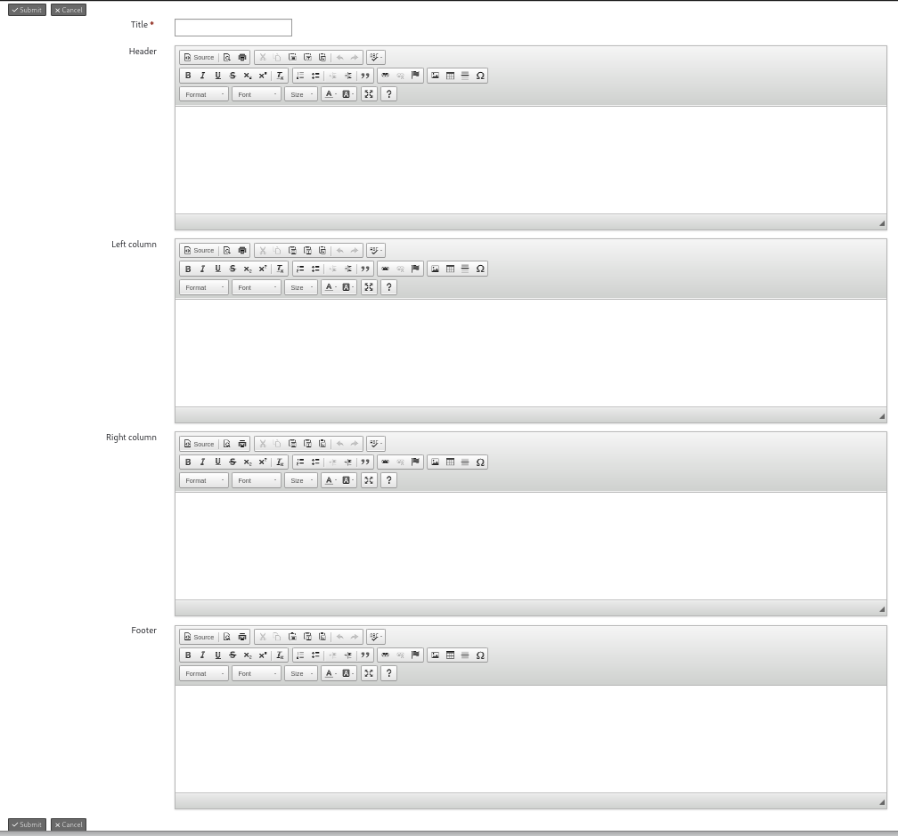

# Landing Pages

Create (landing) pages in your CiviCRM environment.

## Purpose

Landing pages are just HTML pages that can contain text, images, and hyperlinks.
You can use them to e.g. provide some handy shortcuts to your users, to document internal processes, to explain some best practices, etc.

See it as a mini wiki inside CiviCRM.

## Manage Pages

Navigate to: Administer > System Settings > Landing Pages

Click on the button "Add landing page" to create your first page.

A page has the following fields:

 - Title
 - Header
 - Left column
 - Right column
 - Footer

## Page Layouts

Different page layouts can be obtained by filling in or leaving empty the different fields.

If you fill in all fields you will have a page with a header, a left column, a right column, and a footer.

If you want a full width page, just fill in the header (or the footer).

## Links to Other Pages

In the rich text editor you can easily create hyperlinks to other pages. These can be links to existing CiviCRM pages and forms, or links to other landing pages.

The URL structure of landing pages is: /civicrm/landingpage/show?id=ID&reset=1

Replace ID with the unique number of the corresponding page. See Administer > System Settings > Landing Pages.

A quick way to edit the current landing page is by replacing the word "show" in the URL by "edit".
e.g. /civicrm/landingpage/edit?id=5&reset=1

