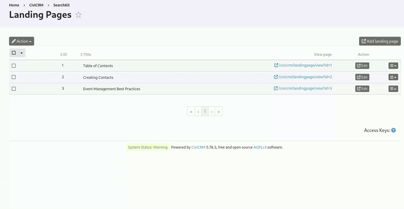

# Landing Pages

Create (landing) pages in your CiviCRM environment.

## Purpose

Landing pages are just HTML pages that can contain text, images, and hyperlinks.
You can use them to e.g. provide some handy shortcuts to your users, to document internal processes, to explain some best practices, etc.

See it as a mini wiki inside your CiviCRM.

## Permissions

This extension creates two permissions that you should assign to appropriate *roles*.

1. **View landing pages**. Give to user accounts who should be able to see these
  pages.
2. **Administer landing pages**. Give to user accounts who should be able to create,
  edit and delete these pages. Implies *View landing pages* permission.

## Manage Pages

Navigate to: Administer > System Settings > Landing Pages

Click on the button "Add landing page" to create your first page.

A page has the following fields:

 - Title
 - Header
 - Left column
 - Right column
 - Footer

Ony the title is mandatory.

## Page Layouts

Different page layouts can be obtained by filling in or leaving empty the different fields.

If you fill in all fields you will have a page with a header, a left column, a right column, and a footer.

If you want a full width page, just fill in the header (or the footer).

Experiment by putting your text in either the header, footer, left column, or the right column to view the different page layouts.

## Hyperlinks to Other Pages

In the rich text editor you can create hyperlinks to other pages. These can be links to existing CiviCRM pages and forms, or links to other landing pages.

The URL structure of a landing page is: /civicrm/landingpage/view?id=ID&reset=1

Replace ID with the unique number of the corresponding page. See Administer > System Settings > Landing Pages.

💡 Tip: A quick way to edit the current landing page is by replacing the word "view" in the URL by "edit".
e.g. /civicrm/landingpage/edit?id=1&reset=1

## Landing Page as Dashlet

A landing page can be added to your CiviCRM Dashboard. Edit the landing page and check the corresponding checkbox at the bottom of the page. Then go to CiviCRM Home, click on "Available Dashlets" and drag and drop the landing page into the right or left column of your dashboard.

## Navigation Menu

Use the standard CiviCRM options to customize the navigation menu (Administer > Customize Data and Screens > Navigation Menu) to create your own documentation structure with links to landing pages.

## Release notes

See [Release Notes](RELEASE-NOTES.md)
